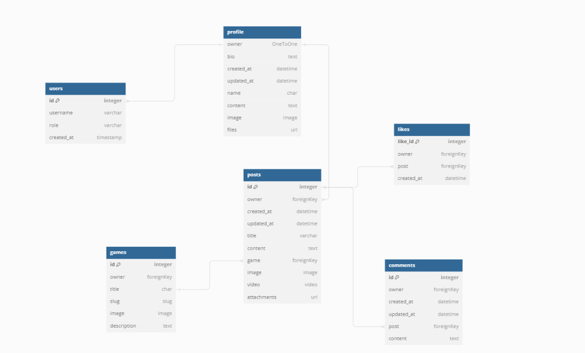

# Souls Like API

Souls like gallery is a content sharing application that is built using the django restframe work and the React front end libary which is designed around allowing users to create read update and delete content by adding posts, editing there own posts and deleting there own posts while also adding comments and likes allowing users to give feedback on posts and also save posts they find useful, this is the backend development pipepline which highlights the process of creating the Souls Like Gallery API.

## CONTENTS

- [Souls Like API](#souls-like-api)
- [Database Relationship Models](#database-relationship-models)
    - [Database Entity relationship diagram](#database-entity-relationship-diagram)
    - [Database Schema](#database-schema)
        - [Profile model](#profile-model)
        - [Game model](#game-model)
        - [Post model](#post-model)
        - [Likes model](#likes-model)
        - [Comment model](#comment-model)
- [Features](#features)
    - [Post](#post)
    - [Game](#game)
    - [Comment](#comment)
    - [Likes](#likes)
    - [Trending](#trending)
- [Testing](#testing)
- [Deployment](#deployment)
    - [Heroku Deployment](#heroku-deployment)
    - [Fork project](#fork-project)
    - [Running application locally](#running-application-locally)
- [Packages](#packages)
- [Credits](#credits)
- [Acknowledgements](#acknowledgements)

## Database Relationship models

### Database Entity relationship diagram

### Database Schema 

The Database Schema for this application is using 6 created models called Profile, Posts, Likes, Trending, Game, Comments and with one imported user model every model but the Game model will have full CRUD functionality which will allow the user to create read update and delete content on the application. Each model will be referenced by its primary key the id of the actual model, these models will be able to interact with each other on the application by using Foreign Keys.

#### Profile Model

This model will be the first model which will allow users to create read update and delete there profile, this model will be accessed when a user clicks on the profile allowing them to see there posts, users will be able to update there bio on the profile page along with change there name if they wish to.

#### Game Model

This model will be accessed if the user wishes to click on the game  title and view all the posts that are linked to this title showing the game title, and the games content,  the posts linked to this game will be found inside the post model.

#### Post Model

This is the main model of the application this will allow users to have full CRUD by adding videos or images to there post. This model will also have access to the games model which will be linked by the games foreign key, users will be able to update there own post and delete there own post. To make sure the correct post is being shown the primary key will be the posts id which makes sure in the URL the correct post is being loaded. A user is also able to click on a specific post to see further content such as the amount of likes and comments.

#### Likes Model

This model uses its id as the primary key. The model will also be using the posts Foreign key to make sure once a like is left the like is being applied to the correct post. A user will be able to unlike also if they wish to choosing which posts they would like to leave likes to.

#### Comment Model

This model uses its id as the primary key to allow users to edit and delete there own comment if they wish to. This model will have full CRUD functionality, allowing a user to create a comment if logged in edit there own comment if logged in or delete there own comment if logged in. This model uses the post model as its foreign key to make sure comments are being applied to the correct post, this model will also have a content field allowing a user to provide detailed feedback.

## Features

### Post

### Game

### Comment

### Likes

### Trending

## Testing 

I tested this project extensively, making sure everything worked as intended this was all documented in the TestingMd file which can be viewed here [TestingMd](https://github.com/mattthughes/souls-like-api/blob/main/TESTING.md)

## Deployment

### Heroku Deployment

### Running Application locally

### Fork Project

## Packages

## Credits

## Acknowledgements

