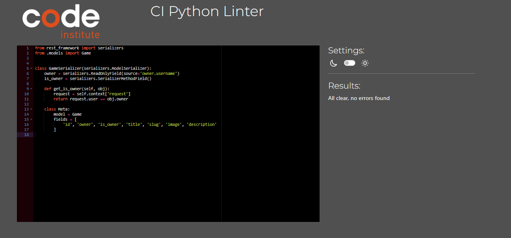

# Testing

Welcome to testing results of The Advanced Frontend Application known as Souls Like Gallery in this document you will find all the testing resuts such as solved bugs, how they were fixed any known bugs, manual and automated testing as well and how they were tested making sure each element worked as intended.

## CONTENTS
- [Testing](#testing)
- [Python Validation](#python-validation)
    - [Posts](#posts)
    - [Games](#games)
    - [Comments](#comments)
    - [Likes](#likes)
    - [Trending](#trending)
- [Solved Bugs](#solved-bugs)
- [Known Bugs](#known-bugs)
- [Manual Testing](#manual-testing)
    - [Aims](#aims)
    - [Testing Steps](#testing-steps)
    - [Testing Results](#testing-results)
- [Automated Testing](#automated-testing)
    - [Aims](#automated-testing-aims)
    - [Testing Logic](#testing-logic)
    - [Testing Results](#automated-testing-results)

### Python Validation

#### Posts

`Model`

`Serializer`

`View`

`URL`

#### Games

`Model`

`Serializer`

`View`

`URL`

#### Comments

`Model`

`Serializer`

`View`

`URL`

#### Likes

`Model`

`Serializer`

`View`

`URL`

#### Trending

`Model`

`Serializer`

`View`

`URL`

### Solved Bugs

* Adjusted profile views was running into errors regarding the post model which I haven't created yet adjusted profile view to generic profile view to remove mention of the post model, the view will be changed at a later date once the post model is created.
* Fixed CRSF Forbidden error when trying to log into api added CRSF trusted origins to settings.py and added development site name to the new CRSF variable which fixed this issue.
* Fixed Game authentication error orginally any authenticated user could create a game or delete there own game which was not the intended purpose. Only the admin user is able to do this. To fix this I adjusted the permissions from authenticated read only to isAdmin, which was checking if the user logged in has admin priveliges, if they do the create view will work otherwise a permission denied message will appear.
* While trying to use the file field for my post model I was only able to upload images uploading any other file type would crash the server, could not find an issue for this when changing the field back to an image field I ran into many errors to fix this I flushed the database and migrated all the models again which fixed these errors.
* Fixed file filed issues by importing VideoMediaCloudinaryStorage from cloudinary and then setting the video field to have a storage argument with the VideoMediaCloudinaryStorage as its argument which fixed this issue.
* Fixed search bug initally while trying to search for a game an I contains error would appear, in order to fix this I targeted the game title along with the game model which allowed me to search for a post by the game associated with this post which fixed this issue.
* Fixed JWT refresh token error initally when trying to login the page would refresh but not log the user in, to fix this I specified if the user was the dev in the env.py file which fixed this issue.
* Fixed bad 400 error on heroku, to fix this I turned debug to true and then saw the allowed hosts was using the http url rather than the heroku url, changing this in the allowed hosts fixed this issue.
* Fixed Game detail view originally a user that was not signed in could access the game detail game id. This error was found while creating the automated game detail tests, in order to fix this I changed the permissions to is.Admin which allowed only an admin user to access this information fixing this error.
* Fixed post view tests orginally I was recieving an error stating the game id cannot be null, to fix this I created a game within the test and assigned it to a variable called test game, after this I created the post model and set the game field to the test game fixing this issue.

### Known Bugs

### Manual Testing

#### Aims

### Testing Steps 

### Automated Testing

#### Automated Testing Aims

* To make sure all views work as intended.
* To make sure there are not any errors during testing.
* To make sure users are only able to view data they own or have privelliges for 

#### Testing Logic

`Post Testing`

`Game Testing`

`Comment Testing`

`Likes Testing`

`Trending Testing`

#### Testing Results
