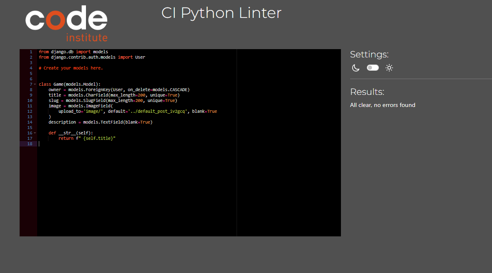
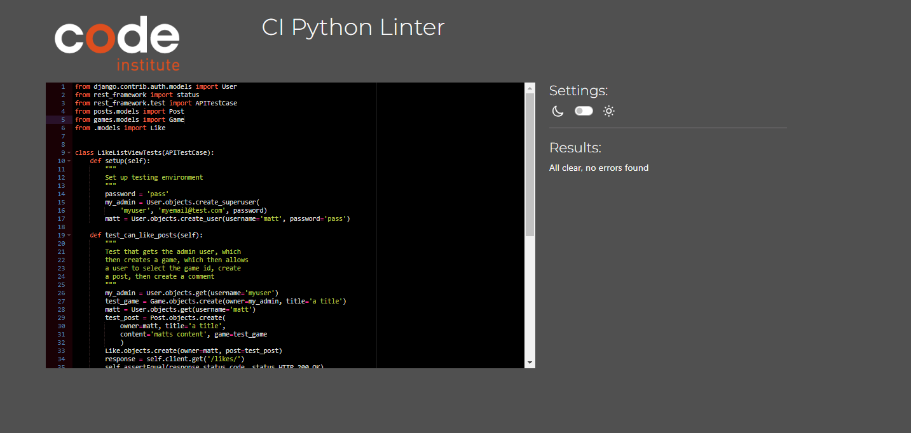
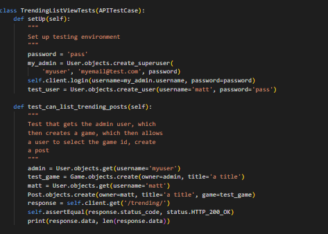

# Testing

Welcome to testing results of The Advanced Frontend Application known as Souls Like Gallery in this document you will find all the testing resuts such as solved bugs, how they were fixed any known bugs, manual and automated testing as well and how they were tested making sure each element worked as intended.

## CONTENTS
- [Testing](#testing)
- [Python Validation](#python-validation)
    - [Posts](#posts)
    - [Games](#games)
    - [Comments](#comments)
    - [Likes](#likes)
    - [Trending](#trending)
- [Solved Bugs](#solved-bugs)
- [Known Bugs](#known-bugs)
- [Manual Testing](#manual-testing)
    - [Aims](#aims)
    - [Testing Steps](#testing-steps)
    - [Testing Results](#testing-results)
- [Automated Testing](#automated-testing)
    - [Aims](#automated-testing-aims)
    - [Testing Logic](#testing-logic)
    - [Testing Results](#automated-testing-results)

### Python Validation

#### Posts

`Model`

`Serializer`

`View`

`URL`

`Tests`

#### Games

`Model`

`Serializer`

`View`

`URL`

`Tests`

#### Comments

`Model`

`Serializer`

`View`

`URL`

`Tests`

#### Likes

`Model`

`Serializer`

`View`

`URL`

`Tests`

#### Trending

`View`

`URL`

`Tests`

### Solved Bugs

* Adjusted profile views was running into errors regarding the post model which I haven't created yet adjusted profile view to generic profile view to remove mention of the post model, the view will be changed at a later date once the post model is created.
* Fixed CRSF Forbidden error when trying to log into api added CRSF trusted origins to settings.py and added development site name to the new CRSF variable which fixed this issue.
* Fixed Game authentication error orginally any authenticated user could create a game or delete there own game which was not the intended purpose. Only the admin user is able to do this. To fix this I adjusted the permissions from authenticated read only to isAdmin, which was checking if the user logged in has admin priveliges, if they do the create view will work otherwise a permission denied message will appear.
* While trying to use the file field for my post model I was only able to upload images uploading any other file type would crash the server, could not find an issue for this when changing the field back to an image field I ran into many errors to fix this I flushed the database and migrated all the models again which fixed these errors.
* Fixed file filed issues by importing VideoMediaCloudinaryStorage from cloudinary and then setting the video field to have a storage argument with the VideoMediaCloudinaryStorage as its argument which fixed this issue.
* Fixed search bug initally while trying to search for a game an I contains error would appear, in order to fix this I targeted the game title along with the game model which allowed me to search for a post by the game associated with this post which fixed this issue.
* Fixed JWT refresh token error initally when trying to login the page would refresh but not log the user in, to fix this I specified if the user was the dev in the env.py file which fixed this issue.
* Fixed bad 400 error on heroku, to fix this I turned debug to true and then saw the allowed hosts was using the http url rather than the heroku url, changing this in the allowed hosts fixed this issue.
* Fixed Game detail view originally a user that was not signed in could access the game detail game id. This error was found while creating the automated game detail tests, in order to fix this I changed the permissions to is.Admin which allowed only an admin user to access this information fixing this error.
* Fixed post view tests orginally I was recieving an error stating the game id cannot be null, to fix this I created a game within the test and assigned it to a variable called test game, after this I created the post model and set the game field to the test game fixing this issue.
* Fixed a comment serializer issue this was trying to access the comment likes field which no longer existed removing this removed the server 500 error
* Fixed post game issue, orginally the user on the front end was only able to target the id of the game and not the actual content of the game. Which caused issues when creating posts and searching for posts under the games title. Which was not possible. To fix this I added the game field to the post serializer with a serializer slug field, setting the slug field to the title field on the games model. After this I used the games model as the query set resulting in the game title being returned rather than the id fixing this issue.
* Fixed errors in front end by adding default pagination and the page results fixing these issues.

### Known Bugs

### Manual Testing

#### Aims

* The aim of testing is to make sure all elements work as intended without any server errors

* This will be done by checking if list and detail view, while also checking if users can create read update and delete there data but cannot delete others.

### Testing Steps 

* I will test that each element works by accessing all set up urls to ensure each element works as intended.

* I will make sure only authenticated users can create, read, update and delete there data whereas updating and deleting other users data is hidden and only the owner can access this data.

`Route`

**Element**|**Expected Outcome**|**Testing Performed**|**Result**|**Pass/Fail**
:-----:|:-----:|:-----:|:-----:|:-----:
Route view|Load Welcome message|Launched API|Loaded Welcome message|Pass

`Game`

**Element**|**Expected Outcome**|**Testing Performed**|**Result**|**Pass/Fail**
:-----:|:-----:|:-----:|:-----:|:-----:
Games View|Show games list|Accessed game view|Showed Games list|Pass
Games create view(superuser)|Load games create form|Tried to access create game view|Loaded create game form|Pass
Games create view(user)|Show Authentication credentials were not provided message|Tried to access create game view|Showed Authentication credentials were not provided|Pass
Games create view(not logged in)|Show Authentication credentials were not provided message|Tried to access create game view|Showed Authentication credentials were not provided|Pass
Games Create view (title empty)|Alert user title may not be blank|Tried to submit form with empty title|Alert informing user title field cannot be blank|Pass
Game Create view (title duplicate)|Alert user game title already exists|Tried to submit form with duplicate game title|Alert informing user title already exists|Pass
Game Create view (slug empty)|Alert user slug may not be blank|Tried to submit form with empty slug|Alert informing user slug cannot be blank|Pass
Game Create view (slug duplicate)|Alert user slug already exists|Tried to submit form with duplicate slug|Alert informing user slug already exists|Pass
Game Create view (submit correct data)|Inform user game created via 201 status code and show game detail|Tried to submit form with correct data|Game detail loaded showing 201 status code informing user game created|Pass
Games edit form(superuser)|Show Game detail and edit form|Tried to access edit game form|Loaded Game detail and edit form|Pass
Games edit form(user)|Authentication credentials were not provided message|Tried to access edit game form|Show Authentication credentials were not provided message|Pass
Games edit form(not logged in)|Authentication credentials were not provided message|Tried to access edit game form|Show Authentication credentials were not provided message|Pass
Games edit form (title blank)|Alert user title may not be blank|Tried to submit form with empty title|Alert informing user title field cannot be blank|Pass
Games edit form (duplicate title)|Alert user game title already exists|Tried to submit form with a duplicate game title|Alert informing user game title already exists|Pass
Games edit form (slug blank)|Alert user slug cannot be blank|Tried to submit form with empty slug|Alert informing slug cannot be blank|Pass
Game edit form (duplicate slug)|Alert user slug already exists|Tried to submit form with a duplicate game|Alert informing user game already exists|Pass
Game edit form (submit correct data)|Inform user game edited via 200 status code and show game detail|Tried to submit form with correct data|Game detail loaded showing 200 status code informing user game edited|Pass
Game delete (superuser)|Pop up message stating are you sure you want to delete this game if deletion confirmed return 204 no content status code|Tried to delete game|Pop up message appeared asking if user was sure upon deletion 204 status code returned|Pass
Game delete (user)|Show Authentication credentials were not provided message for the game detail|Tried to access game detail|Show Authentication credentials were not provided message|Pass
Cancel button|Return game form|Clicked the cancel button|Returned user to game form|Pass

`Posts`

**Element**|**Expected Outcome**|**Testing Performed**|**Result**|**Pass/Fail**
:-----:|:-----:|:-----:|:-----:|:-----:
Posts list|Post lists to show as read only|Loaded posts page|Posts shown as read only|Pass
Posts list(logged in user)|Create form visible|Logged in and loaded posts page|Posts create form visible|Pass
Posts create form (empty title)|Alert informing user post title cannot be blank|Tried to submit post with empty title|Alert informing user post title cannot be blank|Pass
Post empty fields with default settings|Post to be created with default settings for image,content.video.attachments|Submitted post with title, empty image,content,video,attachments|Loaded post detail with title, default fields|Pass
Post correct data|Load post detail|Submitted post with correct data|Loaded post detail|Pass
Post detail|Load post detail by its id and show as read only|Tried to access post id|Loaded post detail and was shown as read only|Pass
Post detail (post author)|Post edit form visible along with edit, delete buttons|Tried to access post id|Post edit form visible along with edit and delete buttons|Pass
Post detail edit post (empty title)|Alert informing user post title cannot be blank|Tried to submit post with empty title|Alert informing user post title cannot be blank|Pass
Post empty fields with default settings|Post to be edited with default settings for image,content.video.attachments|Submitted post with title, empty image,content,video,attachments|Loaded post detail with title, default fields|Pass
Post correct data|Load post detail|Submitted post with correct data|Loaded post detail|Pass
Post detail (delete post)|Pop up stating are you sure you want to delete this post, if deletion confirmed return 204 no content status code|Tried to delete post|Pop up message appeared asking if user was sure upon deletion 204 status code returned|Pass
Cancel button|return post form|Clicked the cancel button|Returned user to post form|Pass

`Comments`

**Element**|**Expected Outcome**|**Testing Performed**|**Result**|**Pass/Fail**
:-----:|:-----:|:-----:|:-----:|:-----:
Comment list|Post lists to show as read only|Loaded comments page|Comments shown as read only|Pass
Comment list(logged in user)|Create form visible|Logged in and loaded comments page|Comment create form visible|Pass
Comments create form (empty comment)|Alert informing comment cannot be blank|Tried to submit comment with empty comment|Alert informing user comment cannot be blank|Pass
Comment correct data|Load comment detail|Submitted comment with correct data|Loaded comment detail|Pass
Comment detail|Load comment detail by its id and show as read only|Tried to access comment id|Loaded comment detail and was shown as read only|Pass
Comment detail (comment author)|Comment edit form visible along with edit, delete buttons|Tried to access comment id|Comment edit form visible along with edit and delete buttons|Pass
Comment detail edit comment (empty comment)|Alert informing user commet cannot be blank|Tried to submit comment with empty comment|Alert informing user comment cannot be blank|Pass
Comment correct data|Load comment detail|Submitted post with correct data|Loaded comment detail|Pass
Comment detail (delete Comment)|Pop up stating are you sure you want to delete this comment, if deletion confirmed return 204 no content status code|Tried to delete comment|Pop up message appeared asking if user was sure upon deletion 204 status code returned|Pass
Cancel button|return comment form|Clicked the cancel button|Returned user to comment form|Pass

`Trending`

**Element**|**Expected Outcome**|**Testing Performed**|**Result**|**Pass/Fail**
:-----:|:-----:|:-----:|:-----:|:-----:
Trending list|Trending list to show as read only|Loaded posts page|Posts shown as read only|Pass
Trending post filter by user profile|Show posts from specific profile|Filtered by user profile|Showed posts from specific user|Pass
Trending detail|Load trending post detail by its id and show as read only|Tried to access trending id|Loaded trending detail and was shown as read only|Pass

`Likes`

**Element**|**Expected Outcome**|**Testing Performed**|**Result**|**Pass/Fail**
:-----:|:-----:|:-----:|:-----:|:-----:
Like list|Show like list as read only|Loaded like list|Like list shown as read only|Pass
Like list(user)|Show like list and create form|Loaded like list|Showed like list and create form|Pass
Like list(post selected)|Like detail to return with 201 status code|Submitted like form |Showed like detail and status 201 code|Pass
Like detail (not logged in)|Show like detail as read only|Loaded like detail|Like detail shown as read only|Pass
Like detail (user)|Show like detail and delete button|Loaded like detail|Showed like detail and delete button|Pass
Like detail delete button|Pop up message asking if the user would like to delete like detail|Clicked delete button and deleted post|Pop up message asking the user if they would like to delete like detail appeared upon deletion 204 no content status code appeared|Pass
Cancel button|Return like detail|Clicked cancel button|Returned like detail|Pass

### Automated Testing

#### Automated Testing Aims

* To make sure all views work as intended.
* To make sure there are not any errors during testing.
* To make sure users are only able to view data they own or have privelliges for 

#### Testing Logic

`Post Testing`

`Game Testing`

`Comment Testing`

`Likes Testing`

`Trending Testing`

#### Testing Results

